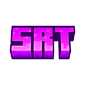
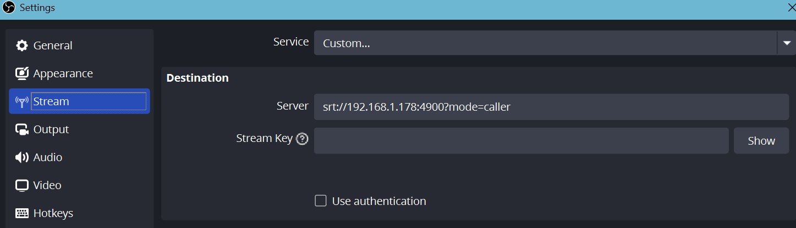

# SRT Mirror

<p align="center"></p>

An Android TV app that receives SRT video streams via [SRTDroid](https://github.com/ThibaultBee/srtdroid) and plays them in real time using ExoPlayer. Point an SRT source (e.g. OBS) at your TV and it mirrors the stream full-screen.

## Requirements

- Android TV device or emulator with ARM support (x86 emulators are not supported)
- Android 7.0 (API 24) or higher

## Building

```bash
./gradlew assembleDebug
```
```bash
./gradlew assembleRelease
```

Requires **JDK 21**.

## Usage

1. Install the APK on your Android TV device
2. Open SRT Mirror — it will display the device's local IP and the listen port
3. In OBS (or any SRT-capable tool), set the output to **SRT** with the URL:

```
srt://<tv_ip>:<port_number>?mode=caller
```


4. Start streaming — the TV will automatically connect and display the feed full-screen

To change the listen port, navigate to **Settings** from the waiting screen.
